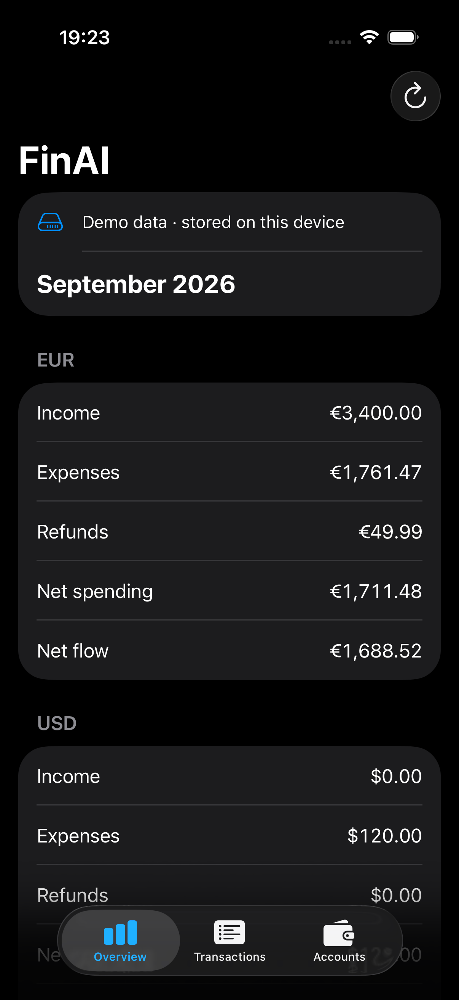
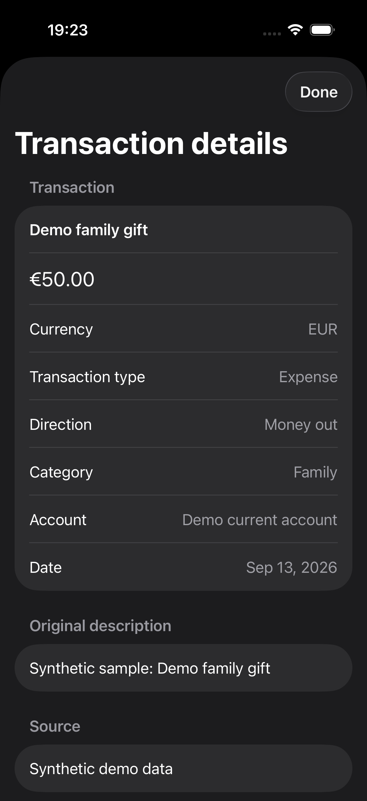

# FinAI

A local-first personal finance app for iOS, building toward an assistant that helps explain financial activity and plan ahead.

## Available today

- Synthetic demo data across bank, savings and credit accounts
- Persistent on-device accounts and transactions using SwiftData
- Monthly income, expenses, refunds, net spending and net flow, grouped by original currency
- A transaction list with original descriptions, categories, source and account details
- English String Catalog localization and locale-aware money and date formatting

Demo data is loaded only after confirmation and only into an empty store. It includes salary, rent, groceries, transport, subscriptions, utilities, shopping, refunds and transfers across three months. No bank account or personal data is needed.

## Screenshots

<p>
  
  
</p>

## How it works

Swift code calculates every total using `Decimal`. Currencies are kept separate, transfers are excluded from spending and income, and refunds reduce net spending without becoming income. Adjustments and unknown transactions are excluded from the monthly summary. The overview describes activity, not account balances.

The app preserves original amounts, currencies, descriptions and source metadata. Its first version provides demo data; importing personal records is planned.

## Architecture

```text
SwiftUI → TCA feature → dependency client → domain services / persistence
```

- **Domain:** value types and deterministic financial calculations, independent of UI and persistence frameworks
- **Features:** TCA state, actions, navigation, confirmation, loading, errors and cancellation
- **Dependencies:** an injectable client connecting features to domain services and storage
- **Infrastructure:** actor-isolated SwiftData access with explicit saves and no model contexts exposed to features

The project uses Swift 6 with strict concurrency checking, SwiftUI, The Composable Architecture 1.26.2, SwiftData, Swift Testing and XCTest UI tests. Package versions are checked in for reproducible resolution with Xcode 27.

## Getting started

Requirements: Xcode 27 or later and an iOS 26 or later simulator or device.

1. Open `FinAI.xcodeproj` and let Xcode resolve Swift packages.
2. Enable the package macros when Xcode prompts.
3. Select the shared **FinAI** scheme and an iOS simulator, then run.
4. Choose **Explore demo** in Overview and confirm.

For a physical device, choose your own signing team for the app and test targets. Demo data persists between launches. Since import and data management are not implemented yet, reinstalling the app provides a fresh demo store.

## Tests

Use **Product → Test** in Xcode, or select an installed simulator from `xcrun simctl list devices available` and run:

```sh
xcodebuild test \
  -project FinAI.xcodeproj \
  -scheme FinAI \
  -destination 'platform=iOS Simulator,name=iPhone 17,OS=latest' \
  -skipMacroValidation \
  -onlyUsePackageVersionsFromResolvedFile \
  CODE_SIGNING_ALLOWED=NO
```

Tests cover decimal arithmetic and validation, currency separation, transfers and refunds, date boundaries, demo integrity, persistence and repeated seeding, feature loading/error/cancellation flows, and the demo-to-transaction-details UI journey. UI tests use an isolated in-memory store. GitHub Actions builds and tests pull requests to `develop` and `main` using the Xcode 27 runner image.

## Privacy

The app stores data locally, with no account, bank connection, remote AI service, analytics SDK or custom backend. SwiftData CloudKit integration is disabled. Future remote processing will require explicit consent and a defined privacy boundary.

## Planned

1. CSV import with preview, validation, categorization and duplicate review; richer deterministic analytics
2. An assistant that queries and explains calculated results
3. Budgets, goals, forecasts and what-if planning
4. Document and receipt import, followed by investigation of connected banking

These capabilities are not yet implemented.
